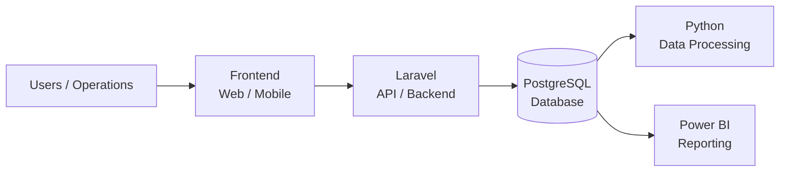

 

---

### 👤 About Me

I'm a **Software Engineer** with experience building web applications, data processing, and automation systems. I'm passionate about finding efficient solutions, working with modern technologies, and always eager to learn something new.

| 💡 Problem Solver               | 🤝 Team Player       | 📚 Continuous Learner     | 🚀 Build for Impact                    |
| ------------------------------- | -------------------- | ------------------------- | -------------------------------------- |
| Turn ideas into working systems | Work better together | Always exploring new tech | Solve real problems, create real value |

---

### 🛠️ Tech Stack

---

### 📊 GitHub Stats

---

### 🚀 Featured Projects

<table>
<tr>
<td width="50%">

**🚚 Astina Tyre** — _Tyre Management System_
Web application to manage vehicle tyres, inventory and lifecycle data.
`Laravel` `PostgreSQL` `iDempiere`

</td>
<td width="50%">

**⚖️ Weighbridge Dashboard** — _Operational Data Platform_
System to collect, process and visualize weighbridge data.
`Python` `Laravel` `PostgreSQL`

</td>
</tr>
<tr>
<td width="50%">

**🔄 KBU Reconciliation** — _Data Reconciliation Engine_
Python-based pipeline to reconcile Excel data with PostgreSQL and trigger stored procedures.
`Python` `Pandas` `PostgreSQL`

</td>
<td width="50%">

**📈 BI & Analytics** — _Business Intelligence_
Interactive dashboards and reports for better business decisions.
`Power BI` `SQL` `DAX`

</td>
</tr>
</table>

---

### 🧩 What I Build

- 🏢 **Enterprise Systems** — Business & operational applications
- 🔧 **Data Engineering** — ETL, validation & reconciliation
- 🤖 **Automation** — Excel → Database → Application
- 📊 **Analytics** — Dashboards & reporting systems
- ⚙️ **Backend** — APIs & database-driven applications

---

### 🏗️ System Architecture

---

### 📌 Selected Repositories

| Repo                                                                         | Description                |
| ---------------------------------------------------------------------------- | -------------------------- |
| ⭐ [astina-tyre](https://github.com/Sidel17/astina-tyre)                     | Tyre Management System     |
| ⭐ [weighbridge-dashboard](https://github.com/Sidel17/weighbridge-dashboard) | Operational Data Platform  |
| ⭐ [kbu-reconciliation](https://github.com/Sidel17/kbu-reconciliation)       | Data Reconciliation Engine |
| ⭐ [bi-analytics](https://github.com/Sidel17/bi-analytics)                   | Power BI Dashboards        |
| ⭐ [csharp-app](https://github.com/Sidel17/csharp-app)                       | Desktop Application (C#)   |
| ⭐ [portfolio](https://github.com/Sidel17/portfolio)                         | Personal Portfolio Website |

---

> _"Small steps build big systems."_

